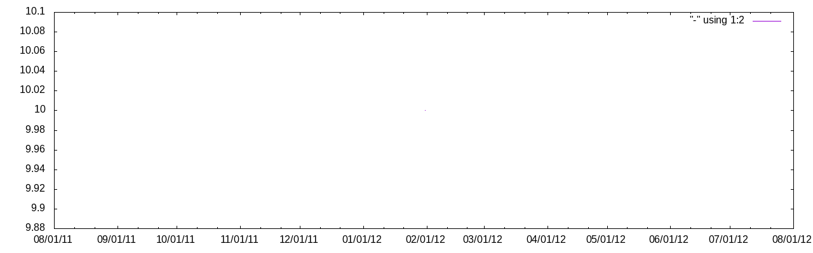

## Ledger template

See [ledger-cli](https://www.ledger-cli.org/) for more info

## Quickstart

    $ ./bin/ledger bal ^Assets
    $ ./bin/ledger bal -p 'this month' ^Expenses
    $ ./bin/ledger bal -p 'this year' ^Expenses:Taxi
    $ ./bin/ledger reg -p 'this month' ^Expenses:Taxi
    $ ./bin/budget -X USD

After you updated ledger/transactions.ldg just execute ./bin/commit

    $ ./bin/commit

## Generated reports

### Assets

```
             $990.00  Assets:Cash
```


### Expenses

#### In this month

```

```



### Budget

```
     $990.00 $-166,110.00  $167,100.00   -1%  Assets
      $10.00  $166,110.00 $-166,100.00     0  Expenses
           0   $11,760.00  $-11,760.00     0    Auto:Gas
      $10.00   $44,100.00  $-44,090.00     0    Food
           0   $14,700.00  $-14,700.00     0    Insurance
           0    $4,900.00   $-4,900.00     0    Movies
           0   $12,250.00  $-12,250.00     0    Phone
           0   $49,000.00  $-49,000.00     0    Rent
           0    $9,800.00   $-9,800.00     0    Utilities
------------ ------------ ------------ -----
   $1,000.00            0    $1,000.00     0
```

---

_Updated: **2019-01-14 14:51**_
